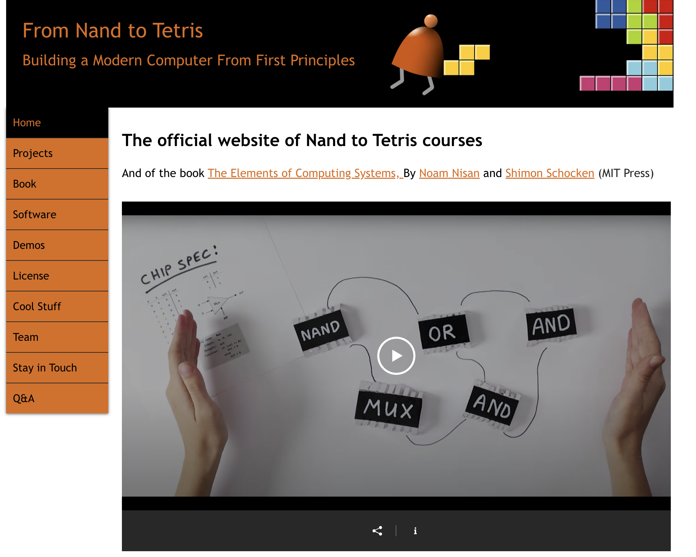

# Unidad 1: Arquitectura de computadores

# **Introducción 📜**

El objetivo de esta unidad es que puedas comprender la arquitectura de un computador digital moderno. Para ello usaremos como caso de estudio un computador simple, pero didáctico llamado computador Hack. Programarás este computador utilizando su lenguaje ensamblador y desarrollarás programas simples, pero interactivos que harán uso de operaciones de entrada/salida.

# **¿Qué aprenderás en esta unidad? 💡**

- Comprender la arquitectura de un computador.
- Conocer el lenguaje ensamblador.
- Desarrollar programas interactivos simples.
- Manipular la memoria.
- Realizar operaciones aritmético-lógicas.
- Controlar el flujo de un programa.
- Manejar la entrada y salida de datos.

# **Actividad 1: el curso Nand2Tetris**

El curso **Nand2Tetris** es un proyecto educativo creado por **Noam Nisan** y **Shimon Schocken** en el que los estudiantes construyen, paso a paso, una computadora completa a partir de compuertas lógicas básicas (`“nand”`) hasta llegar a ejecutar programas y juegos (`“tetris”`). A lo largo del curso se diseñan el hardware, el lenguaje de máquina, el ensamblador, el sistema operativo mínimo y un lenguaje de alto nivel, proporcionando una visión integral de cómo funcionan realmente las computadoras por dentro. Su objetivo principal es **cerrar la brecha entre la teoría y la práctica**, ofreciendo una experiencia de aprendizaje concreta y gradual que permite entender de forma profunda y accesible los fundamentos de la computación.

En esta primera actividad nos vamos a centrar en el Proyecto 4 del curso. Exploremos juntos este proyecto. Ingresa a este [**link**](https://www.nand2tetris.org/) y revisemos la documentación.



Figura 1. Página principal del curso Nand2Tetris

## Arquitectura de un computador moderno

En un computador moderno, como el Hack del curso Nand2Tetris, la **CPU** es el “cerebro” que ejecuta instrucciones realizando operaciones aritméticas y lógicas, y controlando el flujo del programa. Observa la figura 2 como referencia. 

 / Chapter 4 / Copyright © Noam Nisan and Shimon Schocken](image%201.png)

Figura 2. Arquitectura de un computador. Fuente: Nand to Tetris / [www.nand2tetris.org](http://www.nand2tetris.org/) / Chapter 4 / Copyright © Noam Nisan and Shimon Schocken

La CPU se comunica con la **memoria** (donde se almacenan tanto los datos como el programa) a través de **buses de datos** y **buses de direcciones**: los primeros transportan los valores que se leen o escriben, y los segundos indican en qué posición de memoria se realiza esa operación. Estos mismos buses conectan a la CPU y la memoria con los **periféricos de entrada y salida**, como el teclado (entrada) y la pantalla (salida) en Hack, permitiendo que el computador reciba información del exterior y muestre resultados. En conjunto, la arquitectura se basa en que la CPU lee instrucciones y datos desde memoria, los procesa y se comunica mediante los buses con los periféricos para interactuar con el usuario.

# **Actividad 2: Ciclo fetch-decode-execute**

El siguiente programa está escrito en el lenguaje ensamblador del computador Hack. Este computador no es un computador comercial, sino un computador didáctico que te permitirá acercarte a los conceptos fundamentales de manera amigable.

Analiza el siguiente programa (está en lenguaje ensamblador).

```nasm
			@1
			D=A
			@2
			D=D+A
			@16
			M=D
(END)
			@END
			0;JMP
```

**¿Qué crees que haga este programa?**

Para responder a esta pregunta vamos a analizarlo paso a paso usando un simulador de la CPU Hack que está [**aquí](https://nand2tetris.github.io/web-ide/cpu).**

Para ejecutar este programa la CPU realiza un **ciclo** constante llamado Fetch-Decode-Execute.

El ciclo Fetch-Decode-Execute describe cómo la CPU ejecuta instrucciones de un programa. Aquí está explicado de forma breve y simple:

**Fetch (buscar):** la CPU obtiene (lee) la siguiente instrucción desde la memoria. El contador de programa (PC) indica dónde se encuentra esa instrucción en la memoria ROM.

**Decode (decodificar)**: la CPU interpreta la instrucción que acaba de leer. Esto significa entender qué operación debe realizarse y qué datos o recursos necesita.

**Execute (ejecutar)**: la CPU realiza la operación indicada. Por ejemplo, puede ser una operación matemática, mover datos entre registros, o acceder a la memoria.

Este ciclo se repite continuamente mientras la computadora esté encendida, procesando instrucciones una tras otra. Es la base del funcionamiento de cualquier procesador.

<aside>
🧐

**🧪✍️ Experimento**
Ahora es tu turno. Crea un archivo llamado `program.asm` y copia el código del programa anterior. Ejecuta el programa en el simulador de la CPU Hack y observa cómo se comporta. ¿Qué sucede? ¿Qué valor se almacena en la dirección de memoria 16? ¿Por qué crees que es ese valor? ¿Qué instrucciones se ejecutan en cada ciclo Fetch-Decode-Execute? ¿Qué cambios observas en el contenido de la memoria y los registros? ¿Qué instrucciones se ejecutan en cada ciclo Fetch-Decode-Execute?

</aside>

<aside>
🧐

**🧪✍️ Experimento**
Escribe un programa en lenguaje ensablador que sume los números 5 y 10, y almacene el resultado en la dirección de memoria 20. Utiliza el simulador de la CPU Hack para ejecutar tu programa y verifica que el resultado es correcto.

</aside>

<aside>
📤

**Bitácora**
Reporta tus observaciones para cada experimento en tu bitácora de aprendizaje.
¿Qué diferencia hay entre los datos almacenados en la memoria ROM y en la RAM?  

</aside>

# **Investigación 🔎**

Una vez has comprendido los conceptos básicos, es hora de profundizar en el funcionamiento del computador Hack y su lenguaje ensamblador.

# **Actividad 3: Explorando la arquitectura del computador Hack**

Ahora vamos a analizar juntos el siguiente programa. Este programa tendrá todos los conceptos que vamos investigar en la siguiente fase de la unidad de manera más profunda. En qué nos enfocaremos:

- Las partes del computador Hack.
- El modelo de programación de la CPU.
- La diferencia entre memoria RAM y registros.
- Los tipos de instrucciones del lenguaje ensamblador.
- Cómo leo el teclado y muestro en pantalla.
- Cómo implemento un bucle.
- Cómo implemento una condición.
- ¿Qué es la ALU y qué operaciones realiza?

En [**“este”**](https://www.nand2tetris.org/_files/ugd/44046b_7ef1c00a714c46768f08c459a6cab45a.pdf) enlace está la documentación del computador Hack.

```nasm
@SCREEN
D=A
@i
M=D

(READKEYBOARD)
@KBD
D=M
@KEYPRESSED
D;JNE
@i
D=M
@SCREEN
D=D-A
@READKEYBOARD
D;JLE
@i
M=M-1
A=M
M=0
@READKEYBOARD
0;JMP

(KEYPRESSED)
@i
D=M
@KBD
D=D-A
@READKEYBOARD
D;JGE
@16
A=M
M=-1
@i
M=M+1
@READKEYBOARD
0;JMP
```

<aside>
🧐

**🧪✍️ Experimento**
Ahora experimenta. 

Crea un archivo llamado `program.asm` y copia el código del programa anterior. Ejecuta paso a paso el programa en el [**simulador**](https://nand2tetris.github.io/web-ide/cpu) así:

- Carga el programa en el simulador.
- Antes de ejecutar cada instrucción vas a predecir qué crees que va a suceder. Es muy importante que hagas esto, de esta manera tu mismo puedes saber si estás entendiendo el programa.
- Luego, ejecuta la instrucción y observa el resultado.
- Si te equivocas, reflexiona sobre por qué tu predicción no fue correcta.
</aside>

<aside>
📤

**Bitácora**
Reporta en tu bitácora de aprendizaje:

- Identifica una instrucción que use la ALU y explica qué hace.
- ¿Para qué sirve el registro PC?
- ¿Cuál es la diferencia entre @i y @READKEYBOARD?
- Describe qué se necesita para leer el teclado y mostrar información en la pantalla.
- Identifica un bucle en el programa y explica su funcionamiento.
- Identifica una condición en el programa y explica su funcionamiento.
</aside>

# **Aplicación 🛠**

# **Actividad 4: Control de flujo con saltos**

Vamos a resolver juntos este problema:

Escribe un programa que compare el valor almacenado en la dirección de memoria 5 con el valor 10. Si el valor es menor que 10, guarda el valor 1 en la dirección 7. Si el valor es mayor o igual a 10, guarda el valor 0 en la dirección 7.

<aside>
📤

**Bitácora**

- Escribe tu mismo el programa.
- Simula paso a paso. Recuerda la metodología: predice, ejecuta, observa y reflexiona.
</aside>

# **Actividad 5: Implementando un ciclo simple**

Vamos a resolver juntos este problema:

“Crea un programa que use un ciclo para sumar los números del 1 al 5 y guarde el resultado en la dirección de memoria 12.”

<aside>
📤

**Bitácora**

- Escribe tu mismo el programa.
- Simula paso a paso. Recuerda la metodología: predice, ejecuta, observa y reflexiona.
</aside>

# **Actividad 6: Autoevaluación**

**Mirando hacia adentro: autoevaluación de conceptos y proceso**

El objetivo de esta actividad es doble. Primero, que puedas recuperar de tu memoria los conceptos fundamentales de la unidad sin ayuda de tus notas. Este proceso de “recordar” es una de las formas más efectivas de fortalecer tu memoria a largo plazo. Segundo, que reflexiones sobre *cómo* has aprendido, para que puedas identificar qué estrategias te funcionan mejor.

<aside>
📤

**Bitácora**
**Sin consultar tus apuntes**, el simulador o cualquier otro material, responde con tus propias palabras a las siguientes preguntas. ¡No te preocupes por la perfección! El objetivo es ver qué recuerdas ahora mismo.
**Parte 1: recuperación de conocimiento (retrieval practice)**
1. Describe con tus palabras las tres fases del ciclo Fetch-Decode-Execute. ¿Qué rol juega el Program Counter (PC) en este ciclo?
2. ¿Cuál es la diferencia fundamental entre una instrucción-A (que empieza con `@`) y una instrucción-C (que involucra `D`, `M`, `A`, etc.) en el lenguaje ensamblador de Hack? Da un ejemplo de cada una.
3. Explica la función de los siguientes componentes del computador Hack: el registro D, el registro A y la ALU.
4. ¿Cómo se implementa un salto condicional en Hack? Describe un ejemplo (p. ej., saltar si el valor de D es mayor que cero).
5. ¿Cómo se implementa un loop en el computador Hack? Describe un ejemplo (p. ej., un loop que decremente un valor hasta que llegue a cero).
6. ¿Cuál es la diferencia entre la instrucción `D=M` y la instrucción `M=D`?
7. Describe brevemente qué se necesita para leer un valor del teclado (`KBD`) y para “pintar” un pixel en la pantalla (`SCREEN`).
**Parte 2: reflexión sobre tu proceso (metacognición)**
1. ¿Cuál fue el concepto o actividad más desafiante de esta unidad para ti y por qué?
2. La metodología de “predecir, ejecutar, observar y reflexionar” fue central en nuestras actividades. ¿En qué momento esta metodología te resultó más útil para entender algo que no tenías claro?
3. Describe un momento “¡Aha!” que hayas tenido durante estas dos semanas. ¿Qué estabas haciendo cuando ocurrió?
4. Pensando en la próxima unidad, ¿Qué harás diferente en tu proceso de estudio para aprender de manera más efectiva?

</aside>

# **Actividad 7: Coevaluación**

**Aprendiendo juntos: coevaluación constructiva**

Ahora es el momento de aprender de un compañero. La coevaluación es una herramienta poderosa que te permite ver otras perspectivas y aprender a dar retroalimentación constructiva, una habilidad clave. El objetivo no es calificar, sino ayudar a tu compañero a mejorar.

<aside>
📤

**Bitácora**
1. Encuentra un compañero de trabajo.
2. Intercambien las URLs de sus bitácoras de aprendizaje.
3. Lee las entradas de tu compañero correspondientes a las actividades 01, 02, 03 y 04.
4. Utilizando la rúbrica de la unidad, evalúa cada actividad y deja un comentario de retroalimentación *por cada criterio*. Recuerda ser específico y constructivo. Tu feedback debe ayudar a tu compañero a identificar sus fortalezas y áreas de oportunidad. Todos estos comentarios los dejarás en tu propia bitácora.
5. Una vez que hayas terminado, comparte tus comentarios con tu compañero.

</aside>